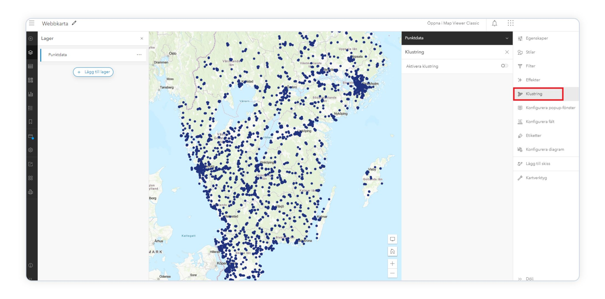

# ProRail Cable Route Evaluator - Development Roadmap

## 📊 Current Status (Phase 3 Complete)

### ✅ Completed Features

**Phase 1: Foundation** ✅
- ArcGIS Maps SDK integration
- ProRail base layers (tracks, stations, track sections)
- Interactive map with layer controls
- Basic application structure

**Phase 2: Route Management** ✅
- Draw new routes (polyline drawing)
- Click-to-add waypoints, double-click to finish
- Smart snapping to railway infrastructure (optional 25m tolerance)
- Geodesic length calculation (accurate km measurements)
- Route storage and management

**Phase 3: Enhanced Editing & UI** ✅
- Numbered waypoints (clear visual feedback)
- Click-to-move waypoint editing system
- Extend routes (from start/end)
- Route list with metadata (length, points, created date)
- Description field for route notes
- Trace color indicator matching map
- Complete UI reorganization:
  - All drawing controls in left panel
  - Only Layer List in top-right
  - Clean, minimal route cards
  - Collapsible edit menus
- Comprehensive style customization:
  - 10 color options
  - 5 line thickness options (2-10px)
  - 5 line style options (solid, dashed, dotted, dash-dot, long-dash)
  - Live preview before applying

---

## 🎯 Next Development Phases

### **Phase 4: Buffer Zone Calculation & Visualization** 🔄 NEXT

**Objective:** Calculate and display distance buffer zones around routes for compliance checking

**Features:**
1. **Buffer Zone Generation**
   - Calculate buffer polygons at key distances:
     - 11m buffer (minimum distance for most cables)
     - 20m buffer (technical room proximity)
     - 31m buffer (no joints zone)
     - 700m buffer (≥35kV non-crossing cables)
   - Display buffers with semi-transparent fills
   - Toggle buffer visibility on/off

2. **Distance Measurement Tools**
   - Calculate minimum distance from route to nearest track
   - Calculate distance to technical rooms
   - Calculate distance to stations
   - Display measurements as labels on map

3. **Visual Feedback**
   - Color-code buffer zones (green=safe, yellow=warning, red=violation)
   - Show distance measurements in route details
   - Highlight problematic route segments

**Technical Tasks:**
- Implement `geometryEngine.buffer()` for buffer generation
- Create buffer graphics layer with appropriate symbology
- Add distance calculation utilities
- Implement buffer toggle controls in UI
- Store buffer data with route information

**Estimated Effort:** 2-3 days

---

### **Phase 5: EMC Compliance Evaluation** 🔜 UPCOMING

**Objective:** Implement automated evaluation against all 8 ProRail RLN00398 criteria

**Features:**
1. **Cable Properties Input**
   - Add form to specify:
     - Nominal voltage (kV)
     - Cable type (three-core, single-phase)
     - Is crossing track? (yes/no)
     - Fault clearing time (ms)
     - Is in insulated pipe? (yes/no)
     - Joint locations (if any)
   - Attach properties to each route

2. **Crossing Angle Calculation** (Criterion 1)
   - Detect where route crosses railway tracks
   - Calculate crossing angle at each intersection
   - Validate angle is between 80° and 100°
   - Highlight non-compliant crossings in red

3. **Distance Evaluations** (Criteria 3-6, 8)
   - **≥35kV cables:** Check 700m distance (or 11m if electrified)
   - **<35kV three-core:** Check 11m distance
   - **<35kV single-phase:** Check 11m distance
   - **Technical rooms:** Check 20m distance
   - **Joints:** Check 31m minimum distance
   - Mark pass/fail for each criterion

4. **Fault Clearing Check** (Criterion 2)
   - Validate fault clearing time ≤ 100ms
   - Simple boolean check from user input

5. **Insulated Pipe Check** (Criterion 7)
   - Verify cable under track is in insulated pipe
   - Boolean check from user input

6. **Compliance Dashboard**
   - Show 8-criteria checklist per route
   - ✅ Green checkmark for compliant
   - ❌ Red X for non-compliant
   - ⚠️ Yellow warning for edge cases
   - Overall compliance score/percentage
   - Traffic light indicator (🟢🟡🔴)

7. **Visual Map Feedback**
   - Color route segments by compliance:
     - Green: Fully compliant
     - Yellow: Minor issues
     - Red: Major violations
   - Add violation markers at problem points
   - Popup details on click

**Technical Tasks:**
- Create cable properties input form component
- Implement angle calculation at track intersections
- Build compliance evaluation engine
- Create compliance dashboard UI
- Implement route segment coloring based on compliance
- Add compliance data to route storage
- Update route cards with compliance indicators

**Estimated Effort:** 4-5 days

---

### **Phase 6: Advanced Analysis & Recommendations** 📅 PLANNED

**Objective:** Provide intelligent insights and route comparison

**Features:**
1. **Multi-Route Comparison**
   - Side-by-side compliance comparison table
   - Highlight best route option
   - Show pros/cons for each route
   - Rank routes by compliance score

2. **Problem Detection & Suggestions**
   - Identify specific violation locations
   - Suggest route adjustments
   - Show alternative paths
   - "Fix it" suggestions with distance needed to move

3. **What-If Analysis**
   - Adjust cable properties and see impact
   - Test different voltage levels
   - Compare crossing vs non-crossing scenarios

4. **Route Optimization Helper**
   - Suggest perpendicular crossings
   - Recommend avoiding technical rooms
   - Highlight safe zones on map

**Technical Tasks:**
- Build comparison matrix component
- Implement route ranking algorithm
- Create suggestion engine
- Add interactive "what-if" controls
- Develop safe zone visualization

**Estimated Effort:** 3-4 days

---

### **Phase 7: Data Import/Export & Reporting** 📅 PLANNED

**Objective:** Enable data exchange and generate professional reports

**Features:**
1. **Import Capabilities**
   - Import routes from GeoJSON
   - Import routes from GPX files
   - Import routes from Shapefile (via conversion)
   - Import cable properties CSV
   - Bulk import multiple routes

2. **Export Capabilities**
   - Export routes as GeoJSON
   - Export routes as GPX
   - Export project data as JSON
   - Export compliance results as CSV/Excel
   - Export buffer zones as Shapefile

3. **PDF Report Generation**
   - Professional compliance report
   - Include map snapshots
   - Show all 8 criteria results
   - Include route details and properties
   - ProRail-ready submission format
   - Company logo/branding options

4. **Project Save/Load**
   - Save entire project to JSON
   - Load project from JSON
   - Browser localStorage integration
   - Cloud storage integration (optional)

**Technical Tasks:**
- Implement file parsers (GeoJSON, GPX)
- Build export utilities
- Integrate PDF generation library (jsPDF or similar)
- Create report templates
- Implement project serialization
- Add save/load UI controls

**Estimated Effort:** 4-5 days

---

### **Phase 8: Data Layers & Technical Rooms** 📅 PLANNED

**Objective:** Add critical ProRail infrastructure layers

**Features:**
1. **Technical Rooms Layer**
   - Load technical rooms from ProRail GIS services
   - Display as polygons or points
   - Show 20m buffer around each
   - Enable querying for distance checks

2. **Additional Infrastructure**
   - Switches/turnouts
   - Signals
   - Power supply locations
   - Catenary (overhead wire) zones
   - Platform edges

3. **Layer Styling & Management**
   - Custom symbology for each layer
   - Layer transparency controls
   - Layer ordering/z-index
   - Enhanced layer list with filtering

**Technical Tasks:**
- Identify ProRail technical room data source
- Create feature layers for additional infrastructure
- Implement custom renderers
- Add layer styling controls
- Update distance calculation to include new layers

**Estimated Effort:** 2-3 days

---

### **Phase 9: User Experience Enhancements** 📅 FUTURE

**Objective:** Polish and improve usability

**Features:**
1. **Guided Tutorials**
   - Interactive walkthrough for first-time users
   - Step-by-step route creation guide
   - Compliance checking tutorial
   - Context-sensitive help

2. **Measurement Tools**
   - Distance measurement tool
   - Area measurement tool
   - Coordinate display
   - Elevation profile (if available)

3. **Search & Location**
   - Address/place search
   - Coordinate input (RD New, WGS84)
   - Zoom to location
   - Bookmark locations

4. **Keyboard Shortcuts**
   - Draw mode: D
   - Select mode: S
   - Delete: Del
   - Undo/Redo: Ctrl+Z / Ctrl+Y
   - Save: Ctrl+S

5. **Mobile Optimization**
   - Touch-friendly controls
   - Responsive layout
   - Gesture support
   - Field-ready interface

**Technical Tasks:**
- Implement tutorial system (e.g., Intro.js)
- Add measurement widgets
- Integrate geocoding service
- Implement keyboard event handlers
- Optimize CSS for mobile
- Add touch event handlers

**Estimated Effort:** 3-4 days

---

### **Phase 10: Performance & Production Readiness** 📅 FUTURE

**Objective:** Optimize and prepare for production deployment

**Features:**
1. **Performance Optimization**
   - Lazy loading for large datasets
   - Route simplification for long lines
   - Caching strategy
   - Progressive rendering
   - Web worker for calculations

2. **Error Handling**
   - Comprehensive error messages
   - Network error recovery
   - Graceful degradation
   - User-friendly error dialogs

3. **Testing**
   - Unit tests for geometry calculations
   - Integration tests for compliance checks
   - E2E tests for user workflows
   - Performance benchmarks

4. **Deployment**
   - Production build configuration
   - CDN setup for assets
   - API key management
   - Environment configuration
   - SSL/HTTPS setup
   - Hosting deployment (Azure/AWS/Netlify)

5. **Documentation**
   - User guide
   - API documentation
   - Developer documentation
   - Deployment guide
   - Troubleshooting guide

**Technical Tasks:**
- Implement caching mechanisms
- Add error boundaries
- Write test suites
- Set up CI/CD pipeline
- Configure production environment
- Create documentation

**Estimated Effort:** 5-7 days

---

## 📋 Priority Matrix

### Critical Path (Must Have)
1. ✅ Phase 1: Foundation
2. ✅ Phase 2: Route Management  
3. ✅ Phase 3: Enhanced Editing & UI
4. 🔄 **Phase 4: Buffer Zones** ← YOU ARE HERE
5. 🔜 Phase 5: EMC Compliance Evaluation
6. Phase 7: Import/Export & Reporting

### High Priority (Should Have)
7. Phase 6: Advanced Analysis
8. Phase 8: Technical Rooms Layer

### Medium Priority (Nice to Have)
9. Phase 9: UX Enhancements
10. Phase 10: Production Readiness

---

## 🎯 Recommended Next Steps

### Immediate (Phase 4 - Buffer Zones)

**Week 1: Buffer Zone Implementation**
1. Add buffer calculation utilities to `drawingUtils.js`
2. Create buffer graphics layer
3. Implement buffer generation on route creation/edit
4. Add buffer visibility toggle controls
5. Style buffers with appropriate colors/transparency

**Week 2: Distance Measurements**
1. Calculate minimum distance to tracks
2. Calculate distance to technical rooms
3. Add distance display in route cards
4. Implement visual distance indicators
5. Test accuracy of measurements

### Short-term (Phase 5 - Compliance Evaluation)

**Week 3-4: Cable Properties & Basic Checks**
1. Design cable properties input form
2. Implement form validation
3. Add fault clearing time check
4. Add insulated pipe check
5. Store properties with routes

**Week 5-6: Geometric Compliance Checks**
1. Implement crossing angle calculation
2. Add distance compliance checks
3. Build compliance dashboard UI
4. Implement route segment coloring
5. Add violation markers

**Week 7: Integration & Testing**
1. Integrate all compliance checks
2. Test with various scenarios
3. Refine UI based on feedback
4. Fix bugs and edge cases
5. Document compliance logic

---

## 🚀 Success Criteria

### Phase 4 Success
- ✅ Buffers display correctly at all zoom levels
- ✅ Distance measurements accurate within 1m
- ✅ Performance remains smooth with multiple routes
- ✅ Buffer toggle works reliably
- ✅ Visual feedback is clear and helpful

### Phase 5 Success
- ✅ All 8 ProRail criteria can be evaluated
- ✅ Compliance results are accurate
- ✅ Dashboard clearly shows pass/fail status
- ✅ Map visualization helps identify problems
- ✅ Cable properties are easy to input
- ✅ Results match manual calculations

### Overall Project Success
- ⏱️ 50%+ reduction in route evaluation time
- ✅ 95%+ accuracy in compliance checking
- 👥 Positive user feedback from cable engineers
- 📊 Used for real ProRail submissions
- 📈 Adoption by multiple engineering firms

---

## 💡 Technical Debt & Future Considerations

1. **Backend Integration** - Currently client-side only. Consider adding backend for:
   - User authentication
   - Project cloud storage
   - Shared projects/collaboration
   - Advanced analysis offloading

2. **Real-time Collaboration** - Allow multiple engineers to work on same project

3. **Version Control** - Track route changes over time with undo history

4. **Integration with ProRail Systems** - Direct submission API if available

5. **Advanced Electromagnetic Modeling** - Beyond simple distance checks

6. **Machine Learning** - Suggest optimal routes based on historical data

7. **3D Visualization** - Show elevation profiles and underground/overhead clearances

---

## 📞 Support & Resources

- **ArcGIS Documentation**: https://developers.arcgis.com/javascript/
- **ProRail RLN00398**: EMC policy document
- **Project Repository**: [Your Git repo]
- **Issue Tracker**: [Your issue tracker]

---

**Last Updated**: October 7, 2025  
**Current Phase**: Phase 4 (Buffer Zones)  
**Next Milestone**: Phase 5 (EMC Compliance Evaluation)
