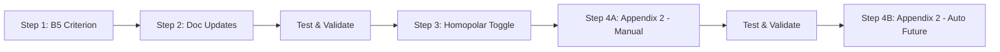

# RLN00398 Version 002 Update Plan
## Cable Route Evaluator Compliance Update

**Date:** October 15, 2025  
**Document:** Migration from RLN00398 V001 (2013) → V002 (2020)  
**Status:** Planning Phase - Awaiting User Confirmation

---

## Executive Summary

The ProRail Cable Route Evaluator is currently based on **RLN00398 Version 001 (01-11-2013)**. ProRail has released **Version 002 (01-12-2020)** with significant updates that affect evaluation logic, thresholds, and assessment criteria.

**Critical Finding:** The application's current evaluation logic contains **outdated thresholds and missing assessment capabilities** that could lead to incorrect compliance assessments.

---

## Detailed Comparison: V001 (2013) vs V002 (2020)

### Changes Summary Table

| Section | Topic | RLN00398 V001 (2013) | RLN00398 V002 (2020) | Impact Level | Implementation Required |
|---------|-------|---------------------|---------------------|--------------|------------------------|
| **5.2** | Initial 8-Point Check | Defined 8 proximity/crossing checks | **Identical** - No change | ✅ None | No action needed |
| **5.3** | Model Study Thresholds | Generic "model study required" | **NEW**: Specific validation thresholds (50%, 80%) | ℹ️ Process | Documentation update only |
| **T4** | Homopolar Current | Assumes 10% homopolar current | **REFINED**: 10% unless "physically impossible" | 🟡 Medium | Add user toggle |
| **B1** | Track Circuit Immunity | Generic: 20 Vcm / 65 Vcm | **ENHANCED**: Generic + length-based tables (Appendix 2) | 🟠 High | New feature opportunity |
| **B5** | 50Hz in 1500V DC | **7V / 25V** (>1s) | **16V / 40V** (>1s) | 🔴 **CRITICAL** | Update thresholds |
| **Bijlage 2** | Track Circuit Tables | Does not exist | **NEW**: 5 detailed immunity tables | 🟠 High | Implement advanced mode |

---

## Impact Analysis

### 🔴 CRITICAL - Immediate Compliance Risk

#### 1. Criterion B5: 50Hz Voltage Limits (OUTDATED)

**Current Application Status:**
- ❌ **NOT FOUND** in current codebase
- Search results show no explicit implementation of B5 criteria
- This appears to be a **missing evaluation rule** entirely

**Required Change:**
```javascript
// CURRENT: Rule does not exist
// REQUIRED: Add new rule with V002 thresholds

{
  id: "DC_TRACTION_50HZ_COMPONENT",
  title: "50Hz component in 1500V DC traction",
  clause: "§ 7 (B5)",
  applicableFor: ["cable", "overhead"],
  applies: (ctx) => {
    // Apply only to routes near 1500V DC traction systems
    return ctx.metadata.electrifiedSystem === "1500v_dc";
  },
  evaluate: (ctx) => {
    // V002 Thresholds:
    const continuousLimit = 16; // V (>1s) - UPDATED from 7V
    const shortCircuitLimit = 40; // V (>1s) - UPDATED from 25V
    
    // Calculate 50Hz induced voltage...
    // Implementation requires voltage calculation model
  }
}
```

**User Question Required:**
- ❓ Is B5 evaluation currently implemented somewhere I haven't found?
- ❓ Should we implement this as a new rule with user input, or calculate from route geometry?

---

### 🟠 HIGH PRIORITY - Accuracy Improvement

#### 2. Appendix 2: Length-Based Track Circuit Immunity (NEW FEATURE)

**Current Application Status:**
- Uses generic 20V / 58A thresholds for all track circuits
- No consideration of actual track circuit length

**New Capability in V002:**
Version 002 introduces **5 detailed tables** (Tables 2-5) that provide immunity values based on:
- Track circuit type (OV 231.111, 231.112, 231.115, 231.116, etc.)
- Actual length (25m increments from 0-700m)
- Operating condition (continuous vs. fault)

**Example from Bijlage 2, Table 2:**
| Length | 231.111-2 | 231.111-3 | 231.112-4 | 231.116-B2 |
|--------|-----------|-----------|-----------|------------|
| 0-25m  | 1006 A    | 2113 A    | 1405 A    | 1839 A     |
| 100-125m | 253 A   | 529 A     | 352 A     | 460 A      |
| 600-625m | 62 A    | 62 A      | 58 A      | 63 A       |

**Implementation Options:**

**Option A: Simple User Input (Recommended First Step)**
```javascript
// Add to route metadata form
metadata: {
  ...,
  trackCircuitLength: null,  // meters
  trackCircuitType: null     // "231.111-2", "231.112-4", etc.
}

// Modified B1 evaluation
evaluate: (ctx) => {
  if (ctx.metadata.trackCircuitLength && ctx.metadata.trackCircuitType) {
    // Use Appendix 2 lookup table
    const threshold = lookupAppendix2Immunity(
      ctx.metadata.trackCircuitType,
      ctx.metadata.trackCircuitLength
    );
  } else {
    // Fall back to generic 20V threshold
    const threshold = 20;
  }
}
```

**Option B: Automatic Detection (Future Enhancement)**
- Query ProRail GIS layers for track circuit boundaries
- Automatically determine length and type
- Requires additional ProRail data layers

**User Questions:**
- ❓ Should Appendix 2 tables be implemented as **Phase 1** (manual input) or **Phase 2** (future enhancement)?
- ❓ Do you have access to ProRail's track circuit type/length data via GIS?

---

### 🟡 MEDIUM PRIORITY - Logic Refinement

#### 3. T4: Homopolar Current Toggle (LOGIC ENHANCEMENT)

**Current Application Status:**
- No explicit homopolar current modeling found in current code
- Application evaluates based on geometric proximity only

**V002 Clarification (Table T4):**
> "10% Homopolaire stroom hoeft niet te worden meegenomen als dit door de netwerktopologie fysiek onmogelijk is bijvoorbeeld door het ten minste niet aarden sterpunt aan één zijde van de verbinding."

**Translation:**
"10% homopolar current need not be considered if this is physically impossible due to network topology, for example due to an ungrounded star point on at least one side of the connection."

**Implementation:**
```javascript
// Add to route metadata form
metadata: {
  ...,
  considerHomopolarCurrent: true  // Default: checked
}

// Modify asymmetry-related evaluations
evaluate: (ctx) => {
  if (!ctx.metadata.considerHomopolarCurrent) {
    return {
      status: "pass",
      message: "Homopolar current physically impossible (ungrounded network topology)"
    };
  }
  // ... continue with normal asymmetry evaluation
}
```

**UI Addition:**
```html
<div class="input-group">
  <input type="checkbox" id="homopolar-toggle" checked>
  <label for="homopolar-toggle">
    Consider 10% Homopolar Current (Asymmetry)
    <span class="tooltip">ⓘ
      <span class="tooltiptext">
        Uncheck if high-voltage network has ungrounded star point 
        or other topology that makes homopolar current physically impossible. 
        (RLN00398 V002, Table T4)
      </span>
    </span>
  </label>
</div>
```

---

### ℹ️ LOW PRIORITY - Documentation Updates

#### 4. Document References

**Current Application Status:**
- All references say "RLN00398" without version specification
- Found in: `translations.js`, `main.js`, `index.html`, multiple MD files

**Required Updates:**
Change all instances of:
```
"RLN00398"
```
To:
```
"RLN00398, Version 002 (01-12-2020)"
```

**Files to Update:**
1. `src/i18n/translations.js` - Lines 3, 119, 289, etc.
2. `src/main.js` - Line 5
3. `index.html` - Line 134
4. All documentation markdown files

---

## Current Application Audit Results

### ✅ What's Working (No Changes Needed)

1. **8-Point Check Structure**: Current evaluation rules align with V002 Section 5 structure
2. **Crossing Angle**: §5.1(1), §5.2(1) - Correctly implemented (80°-100°)
3. **Fault Clearing Time**: §5.1(4), §5.2(2) - Correctly implemented (≤100ms)
4. **Distance Thresholds**: 
   - Technical rooms: 20m - Correct
   - Joints/Earthing: 31m - Correct
   - Track clearances: 700m / 11m - Correct

### ❌ What's Missing/Outdated

1. **B5 Criterion**: 50Hz DC traction voltage limits - **NOT IMPLEMENTED**
2. **Appendix 2 Tables**: Length-based track circuit immunity - **NOT AVAILABLE**
3. **Homopolar Toggle**: T4 network topology consideration - **NOT IMPLEMENTED**
4. **Version References**: All docs reference generic "RLN00398" - **NEEDS UPDATE**

---

## Proposed Implementation Plan

### Phase 1: Critical Compliance Fixes (HIGH PRIORITY)

#### Step 1: Implement B5 Criterion (50Hz in DC Traction)
**Estimated Effort:** 4-6 hours  
**Complexity:** Medium (requires voltage calculation model or user input)

**Tasks:**
1. Add new evaluation rule to `emcEvaluator.js`
2. Add UI inputs for 50Hz voltage measurement/calculation
3. Implement V002 thresholds (16V/40V)
4. Add translations (EN/NL)
5. Update report generation logic

**Deliverables:**
- New rule: `DC_TRACTION_50HZ_COMPONENT`
- Updated evaluation summary
- Test cases for validation

**Questions for User:**
- ❓ Should 50Hz voltage be **user-provided** or **calculated from route geometry**?
- ❓ Is there existing ProRail calculation methodology we should follow?

---

#### Step 2: Update All Document References
**Estimated Effort:** 1-2 hours  
**Complexity:** Low (find/replace with validation)

**Tasks:**
1. Update all code references to "RLN00398, Version 002 (01-12-2020)"
2. Update translations (both EN and NL)
3. Update README and documentation files
4. Update report templates

---

### Phase 2: Enhanced Accuracy Features (MEDIUM PRIORITY)

#### Step 3: Add Homopolar Current Toggle (T4)
**Estimated Effort:** 2-3 hours  
**Complexity:** Low

**Tasks:**
1. Add checkbox to route parameters UI
2. Update evaluation logic to respect toggle
3. Add translations and tooltips
4. Update report to document user selection

---

#### Step 4: Implement Appendix 2 Tables (Track Circuit Length-Based Immunity)
**Estimated Effort:** 8-12 hours  
**Complexity:** High (requires table data structure + lookup logic)

**Tasks:**
1. Create data structure for Appendix 2 tables (Tables 2-5)
2. Implement lookup function for immunity values
3. Add UI inputs (optional: track circuit length + type)
4. Modify B1 evaluation to use length-based thresholds
5. Add "Advanced Mode" toggle for this feature
6. Update translations and help text
7. Add to reports with explanations

**Option: Two-Phase Delivery**
- **Phase 2A:** Manual input (user provides length/type)
- **Phase 2B:** Automatic detection (query ProRail GIS - future)

---

## Implementation Sequence (Step-by-Step)

### Recommended Approach: **Option A (Safest)**

**Rationale:** Deliver critical compliance fixes first, then add enhancements incrementally with validation at each step.



---

## Questions Requiring User Input (STOP & ASK)

### 1. B5 Implementation Method
**Question:** How should the 50Hz voltage component in DC traction be determined?

**Options:**
- **A.** User provides measured/calculated value (simplest)
- **B.** Application calculates from route geometry + current data (complex, needs calculation model)
- **C.** Not applicable to most use cases - make optional/advanced feature

**Your answer:** _________________

---

### 2. Appendix 2 Priority
**Question:** When should length-based track circuit immunity (Appendix 2) be implemented?

**Options:**
- **A.** Phase 1 - Implement alongside B5 fix (manual input only)
- **B.** Phase 2 - After core fixes are validated (manual input)
- **C.** Future enhancement - not critical for initial compliance

**Your answer:** _________________

---

### 3. Track Circuit Data Availability
**Question:** Does ProRail provide GIS data for track circuit types and lengths?

**Options:**
- **A.** Yes, available via existing map services
- **B.** No, users must input manually
- **C.** Unknown - requires investigation

**Your answer:** _________________

---

### 4. Homopolar Current Default
**Question:** What should be the default state for the homopolar current toggle?

**Options:**
- **A.** Checked (conservative - assume homopolar current possible)
- **B.** Unchecked (user must confirm if applicable)
- **C.** Auto-detect based on network type (complex)

**Your answer:** _________________

---

### 5. Implementation Timeline Preference
**Question:** What's your preferred implementation approach?

**Options:**
- **A.** Quick fix - B5 + Doc updates only (1 week)
- **B.** Comprehensive - All changes in sequence (3-4 weeks)
- **C.** Incremental - Deliver and test each step before proceeding (4-6 weeks)

**Your answer:** _________________

---

## Risk Assessment

### Risks of NOT Updating

| Risk | Severity | Probability | Impact |
|------|----------|-------------|--------|
| Incorrect compliance assessments | 🔴 High | High | Routes may be incorrectly rejected or approved |
| Regulatory non-compliance | 🔴 High | Medium | Application references outdated standard |
| Overly conservative evaluations | 🟡 Medium | High | B5 limits too restrictive, unnecessary design constraints |
| Missed optimization opportunities | 🟡 Medium | High | Can't use length-based immunity for better accuracy |
| User confusion about standards | 🟢 Low | Medium | Version mismatch in documentation |

### Risks of Updating

| Risk | Severity | Probability | Mitigation |
|------|----------|-------------|------------|
| Regression in existing functionality | 🟡 Medium | Low | Comprehensive testing of all rules |
| User retraining required | 🟢 Low | High | Clear documentation + tooltips |
| Data input burden increases | 🟡 Medium | Medium | Make advanced features optional |
| Calculation errors in new logic | 🟡 Medium | Medium | Validation against reference cases |

---

## Next Steps - AWAITING YOUR CONFIRMATION

**⏸️ Development is PAUSED pending your responses to the 5 questions above.**

Once you provide:
1. ✅ Answers to Questions 1-5
2. ✅ Approval of implementation approach
3. ✅ Any additional requirements or constraints

I will proceed with:
1. **Detailed technical design** for each component
2. **Code implementation** step-by-step with validation
3. **Testing plan** with reference cases
4. **Documentation updates** for users

---

## Reference Documents

- ✅ **RLN00398 Version 001** - `RLN00398-V001 eisen EMC spoor.md` (workspace)
- ✅ **RLN00398 Version 002** - `RLN00398-V002.md` (newly extracted)
- ✅ **Current Application Code** - `cable-route-evaluator/src/` (analyzed)
- ✅ **Comparison Analysis** - This document

---

## Appendix: V002 Key Excerpts

### B5 Criterion (Updated Threshold)

**V002, Section 7, B5:**
> "50Hz spanningscomponent in de 1500 VDC tractiespanning:
> - Maximaal **16V/40V (>1s)** (beschikbaarheid/veiligheid).
>
> Rijdend materieel kan bij een 50 Hz spanningscomponent in de 1500V DC tractiespanning, problemen in de railinfrastructuur veroorzaken. In de RIS is opgenomen dat materieel bij een 50V50Hz spanning onder de 5.3A75Hz blijft. Voor bestaand materieel is dit vastgelegd in [3].
>
> Voor enkelbenige spoorstroomlopen wordt een grenswaarde van 1.7A/4.25A (T > 1.8s) (beschikbaarheid/veiligheid) gehanteerd. Wanneer deze lineair worden geschaald (aanname), dan komt men uit op een spanning van **16V/40V**."

### T4 Homopolar Current Exception

**V002, Section 6.2, Table T4:**
> "Bij de berekening dient minimaal rekening worden gehouden met 10% homopolaire stroom bij normaal bedrijf per circuit.
>
> **10% Homopolaire stroom hoeft niet te worden meegenomen als dit door de netwerktopologie fysiek onmogelijk is** bijvoorbeeld door het ten minste niet aarden sterpunt aan één zijde van de verbinding. Netwerkbeheerder dient hiervoor onafhankelijk getoetste onderbouwing te leveren."

### Appendix 2 Tables (Sample)

**V002, Bijlage 2, Tabel 2: 50Hz immuniteit enkelbenige spoorstroomlopen**

See full tables in `RLN00398-V002.md` - Tables 2-5 provide:
- Current immunity (Amperes) for continuous operation
- Voltage immunity (Volts) at 10Ω earth fault
- Current immunity (Amperes) for fault conditions (>100ms, ≤500ms)
- Voltage immunity (Volts) for fault conditions

All values are length-dependent (25m increments, 0-700m range) and type-specific (OV 231.111, 231.112, 231.115, 231.116 variants).

---

**END OF DOCUMENT**

*Prepared by: GitHub Copilot (AI Assistant)*  
*Date: October 15, 2025*  
*Status: Awaiting User Confirmation to Proceed*
